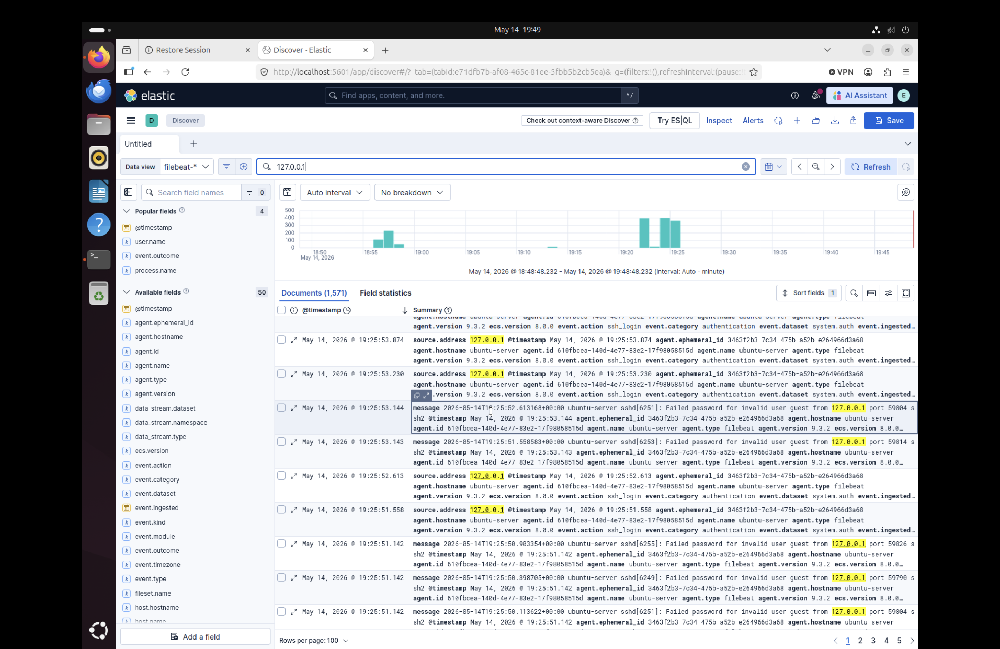

# SOC Investigation Report
## SSH Brute Force Attack Detection Using ELK Stack

---

### Report Details

| Field | Details |
|---|---|
| **Report ID** | IR-2026-002 |
| **Date** | 2026-05-14 |
| **Analyst** | Junior SOC Analyst — L1 |
| **Severity** | HIGH |
| **Status** | CLOSED — NO BREACH |
| **MITRE ATT&CK** | T1110 — Brute Force |
| **SIEM Platform** | ELK Stack |

---

### Executive Summary

During a home lab exercise I configured an ELK Stack SIEM
to monitor SSH authentication logs on an Ubuntu server.
I then simulated a brute force attack using Hydra to
generate real attack traffic. The SIEM successfully
captured 1713 failed login attempts in real time.
No successful login occurred. This report documents
what I observed, how I investigated it, and what
I would recommend to fix the security gaps identified.

---

### 1. What Happened

A brute force attack is when an attacker tries many
different username and password combinations repeatedly
until they find one that works — like trying every key
on a keyring until one opens the door.

In this lab I used a tool called Hydra to simulate
this type of attack against my own Ubuntu server.
Hydra used two wordlists I created:

- **usernames.txt** — 13 common usernames like root,
  admin, test, guest
- **passwords.txt** — 13 common passwords like
  password, 123456, admin

Hydra tried every username with every password
combination against the SSH service on port 22.
This generated 1713 log entries in total because
Hydra ran 4 threads simultaneously.

---

### 2. How I Detected It

I used the ELK Stack SIEM to monitor the attack:

**Elasticsearch** stored all the log data

**Filebeat** collected logs from /var/log/auth.log
on the Ubuntu server and shipped them to Elasticsearch
automatically in real time

**Kibana** gave me a visual dashboard where I could
search the logs and see what was happening

When I ran the attack I could see the histogram in
Kibana spike immediately — going from zero events
to hundreds of events within seconds. This is exactly
the kind of spike that would trigger an alert in a
real SOC environment.

**Screenshot 1 — Kibana Histogram Spike:**


---

### 3. What I Found In The Logs

I searched Kibana using this query:
Failed password for invalid user
This returned **1713 results** — all failed login attempts
from the Hydra attack.

**Screenshot 2 — Kibana Search Results:**


Every log entry looked like this:
2026-05-14T19:25:55 ubuntu-server sshd:
Failed password for invalid user guest
from 127.0.0.1 port 59790 ssh2
This tells me:
- **When** it happened — exact timestamp
- **What system** was targeted — ubuntu-server
- **What service** was targeted — sshd (SSH)
- **What username** was tried — guest
- **Where it came from** — 127.0.0.1
- **What port** the connection came from — 59790

**Important observation:** Every username returned
"invalid user" — meaning none of the usernames in
the wordlist actually exist on my system. This tells
me the attacker was using a generic list with no
specific knowledge about my system.

**Screenshot 3 — Sample Log Entry:**


---

### 4. Was It a True Positive or False Positive?

One of the most important skills in SOC work is
deciding whether an alert is real or a false alarm.

I asked myself these questions:

| Question | Answer | Meaning |
|---|---|---|
| Is 1713 failed logins normal? | NO | Anomalous activity |
| Could this be a scheduled task? | NO | No maintenance scheduled |
| Is 127.0.0.1 a trusted source? | NO | Not whitelisted |
| Did any login succeed? | NO | Attack failed |
| Is the speed normal? | NO | Too fast for human typing |

**Verdict: TRUE POSITIVE — Real brute force attack confirmed**

---

### 5. MITRE ATT&CK Mapping

MITRE ATT&CK is a framework that categorises attack
techniques used by real attackers. Mapping an incident
to this framework helps analysts understand what the
attacker was trying to do.

| Tactic | Technique | ID | What I Observed |
|---|---|---|---|
| Credential Access | Brute Force | T1110 | 1713 failed login attempts |
| Credential Access | Password Spraying | T1110.003 | Multiple usernames tried |
| Initial Access | External Remote Services | T1133 | SSH port 22 targeted |

---

### 6. Attack Timeline

| Time (UTC) | What Happened |
|---|---|
| 19:25:55 | First failed attempt detected in Kibana |
| 19:25 - 19:27 | 1713 attempts across all username combinations |
| 19:27 | Attack stopped — Hydra finished wordlist |
| 19:28 | Kibana histogram spike observed |
| 19:30 | Investigation started in Kibana |
| 19:45 | Investigation complete |

---

### 7. Impact Assessment

| Area | Was It Affected? | Why |
|---|---|---|
| Confidentiality | NO | No successful login occurred |
| Integrity | NO | No files or settings were changed |
| Availability | MINOR | SSH service handled the load |
| Data | NO | No data was accessed or stolen |
| Business | LOW | Attack failed before doing damage |

---

### 8. What Should Be Fixed

Based on what I found I would recommend these
improvements to harden the SSH service:

**Fix 1 — Disable Password Authentication**

Right now SSH allows login with a username and password.
This is what makes brute force attacks possible.
The fix is to use SSH keys instead — a much stronger
method that cannot be brute forced.

How to fix:
```bash
sudo nano /etc/ssh/sshd_config
# Change this line:
PasswordAuthentication yes
# To this:
PasswordAuthentication no
```

**Fix 2 — Install fail2ban**

fail2ban is a tool that automatically blocks an IP
address after a set number of failed login attempts.
If it had been installed during this attack it would
have blocked 127.0.0.1 after 3 failed attempts —
stopping the attack at attempt 3 instead of attempt 1713.

How to install:
```bash
sudo apt install fail2ban
```

**Fix 3 — Change SSH Default Port**

SSH runs on port 22 by default. Automated attack tools
scan for port 22 specifically. Changing it to a
non-standard port reduces the volume of automated attacks.

**Fix 4 — Set Up Automated SIEM Alerting**

In this lab I detected the attack by manually checking
Kibana. In a real SOC environment an automated alert
would fire when failed logins exceed a threshold —
for example 10 failed attempts from one IP in
one minute. This ensures no attack goes unnoticed
even when an analyst is not watching.

---

### 9. What I Learned From This Lab

**About attacks:**
- Brute force attacks are automated and very fast
- Attackers use generic wordlists — they do not always
  know who they are targeting
- 1713 attempts happened in under 2 minutes —
  impossible to detect manually without a SIEM

**About detection:**
- ELK Stack successfully captured every single attempt
- Filebeat shipped logs in real time with no delay
- Kibana histogram made the attack immediately visible
- Without SIEM visibility this attack would have been
  completely invisible

**About SOC analysis:**
- Distinguishing true positives from false positives
  requires checking multiple indicators
- MITRE ATT&CK helps categorise and communicate
  what attackers are doing
- Documentation is critical — every finding must
  be recorded with evidence

---

### 10. Lab Setup

| Component | Details |
|---|---|
| Operating System | Ubuntu Server |
| SIEM | ELK Stack 9.3.2 |
| Log Shipper | Filebeat 9.3.2 |
| Log Source | /var/log/auth.log |
| Attack Tool | Hydra — own machine only |
| Detection Method | Kibana — failed password search |
| Total Attempts | 1713 |
| Successful Logins | 0 |

---

### Analyst Notes

This was a home lab simulation. All activity was
performed on my own Ubuntu virtual machine for
learning purposes. The attack tool was pointed
at 127.0.0.1 — meaning it never left my own machine.

The goal was to understand how brute force attacks
appear in a SIEM and practice real SOC investigation
methodology from detection through to documentation.

---

*Report written by Esther Kimatu — Home Lab Exercise*
*Date: 2026-05-14*
*Framework: NIST SP 800-61 Incident Response*
